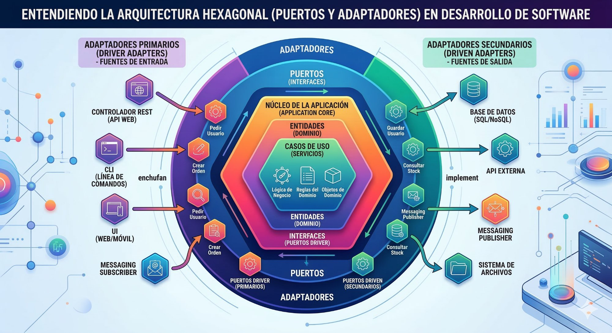

# Arquitectura Hexagonal (Puertos y Adaptadores)



---

## ¿Qué es la arquitectura hexagonal?

Es una forma de organizar el código de una aplicación para que **la lógica de negocio (el núcleo)** no dependa de nada externo: ni de la base de datos, ni de la interfaz web, ni de ningún servicio de terceros.

La idea es simple: el núcleo de tu app no sabe con quién habla. Habla a través de **puertos** (contratos), y el mundo exterior se conecta a través de **adaptadores** (implementaciones concretas).

---

## Las tres capas

### 1. Núcleo de la aplicación (Application Core)

Es el corazón. Contiene todo lo que hace única a tu aplicación:

- **Dominio** → Las reglas del negocio.  
  *Ejemplo: "Un usuario no puede hacer más de 3 pedidos al día".*

- **Casos de uso (Servicios)** → Las acciones que puede realizar tu app.  
  *Ejemplo: `CrearPedido`, `ConsultarStock`, `RegistrarUsuario`.*

El núcleo **nunca** importa librerías externas como Sequelize, Axios o Express. Es código puro.

---

### 2. Puertos (Interfaces / Contratos)

Son **interfaces** que definen cómo se comunica el núcleo con el exterior. No contienen código real, solo la firma de los métodos.

**Puerto de entrada (Driver Port):**  
Define cómo el exterior puede llamar a tu aplicación.  
*Ejemplo: la interfaz `PedidoService` con el método `crearPedido(datos)`.*

**Puerto de salida (Driven Port):**  
Define cómo tu aplicación llama al exterior.  
*Ejemplo: la interfaz `PedidoRepository` con el método `guardar(pedido)`.*

> Un puerto es como un **enchufe en la pared**: define la forma estándar de conectarse, sin importar qué aparato enchufas.

---

### 3. Adaptadores (Adapters)

Son las **implementaciones concretas** de los puertos. Traducen entre el mundo exterior y el núcleo.

#### Adaptadores primarios — Fuentes de ENTRADA (Driver Adapters)

Reciben peticiones del exterior y las pasan al núcleo.

| Término técnico | Ejemplo real |
|---|---|
| Controlador REST / API Web | Un endpoint `POST /pedidos` en Express que recibe la petición HTTP del usuario |
| CLI (Línea de comandos) | Un script que ejecutas con `node app.js crear-pedido` |
| UI Web / Móvil | El botón "Confirmar compra" de una web o app que llama al caso de uso |
| Messaging Subscriber | Un consumidor de RabbitMQ que escucha mensajes y activa un caso de uso |

#### Adaptadores secundarios — Fuentes de SALIDA (Driven Adapters)

Reciben llamadas del núcleo y las ejecutan en el exterior.

| Término técnico | Ejemplo real |
|---|---|
| Base de datos SQL/NoSQL | Una clase `PostgresUserRepository` que hace `INSERT INTO usuarios` cuando el núcleo pide guardar un usuario |
| API externa | Una clase que llama a la API de Stripe cuando el núcleo pide procesar un pago |
| Messaging Publisher | Una clase que publica un mensaje en Kafka cuando se crea un pedido |
| Sistema de archivos | Una clase que guarda un PDF en disco cuando el núcleo pide generar una factura |

---

## Flujo completo con ejemplo real

Imagina que un usuario pulsa **"Hacer pedido"** en una tienda online:

```
[Usuario en la web]
       |
       v
Adaptador entrada: Controlador REST
  -> recibe POST /pedidos con los datos del formulario
       |
       v
Puerto de entrada: interfaz PedidoService
       |
       v
Caso de uso: CrearPedido (nucleo)
  -> valida las reglas de negocio
  -> comprueba que hay stock
       |
       v
Puerto de salida: interfaz PedidoRepository
       |
       v
Adaptador salida: PostgresPedidoRepository
  -> ejecuta INSERT INTO pedidos en la base de datos
```

El núcleo (`CrearPedido`) nunca sabe que existe PostgreSQL, ni Express, ni la web. Solo habla con interfaces.

---

## El concepto de contrato (interfaz)

Un **contrato** es una interfaz que define qué métodos existen, sin decir cómo se implementan.

```typescript
// Esto es el CONTRATO (puerto de salida)
interface PedidoRepository {
  guardar(pedido: Pedido): Promise<void>;
  buscarPorId(id: string): Promise<Pedido>;
}

// Adaptador real -> habla con PostgreSQL
class PostgresPedidoRepository implements PedidoRepository {
  async guardar(pedido: Pedido) {
    await db.query('INSERT INTO pedidos...', pedido);
  }
  async buscarPorId(id: string) {
    return db.query('SELECT * FROM pedidos WHERE id = $1', [id]);
  }
}

// Adaptador de pruebas -> guarda en memoria, sin base de datos
class InMemoryPedidoRepository implements PedidoRepository {
  private pedidos = new Map();
  async guardar(pedido: Pedido) { this.pedidos.set(pedido.id, pedido); }
  async buscarPorId(id: string) { return this.pedidos.get(id); }
}
```

El núcleo solo conoce `PedidoRepository`. No sabe cuál de los dos usa. Eso lo decide quien monta la aplicación (inyección de dependencias).

---

## Beneficios clave

| Beneficio | Qué significa en la práctica |
|---|---|
| **Testeabilidad** | Puedes probar toda la lógica con repositorios en memoria, sin base de datos real |
| **Intercambiabilidad** | Cambiar de MySQL a MongoDB solo requiere escribir un nuevo adaptador; el núcleo no se toca |
| **Independencia de framework** | Puedes cambiar de Express a Fastify sin tocar una sola regla de negocio |
| **Longevidad** | El núcleo (lo más valioso) queda protegido de los cambios tecnológicos |

---

## Resumen en una frase

> El dominio define los contratos (puertos). El exterior los cumple (adaptadores). El núcleo nunca sabe con quién habla.
